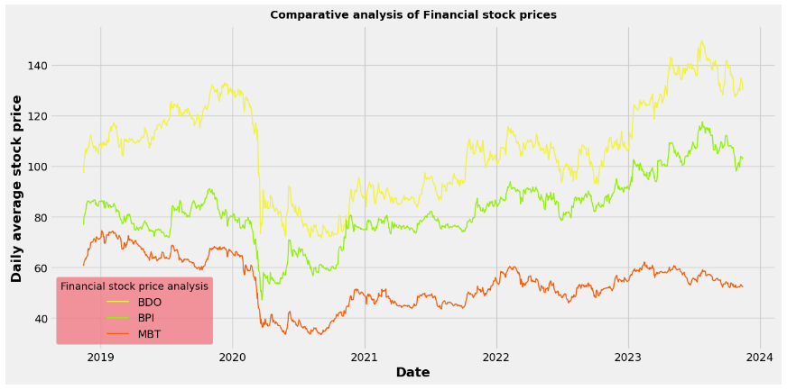
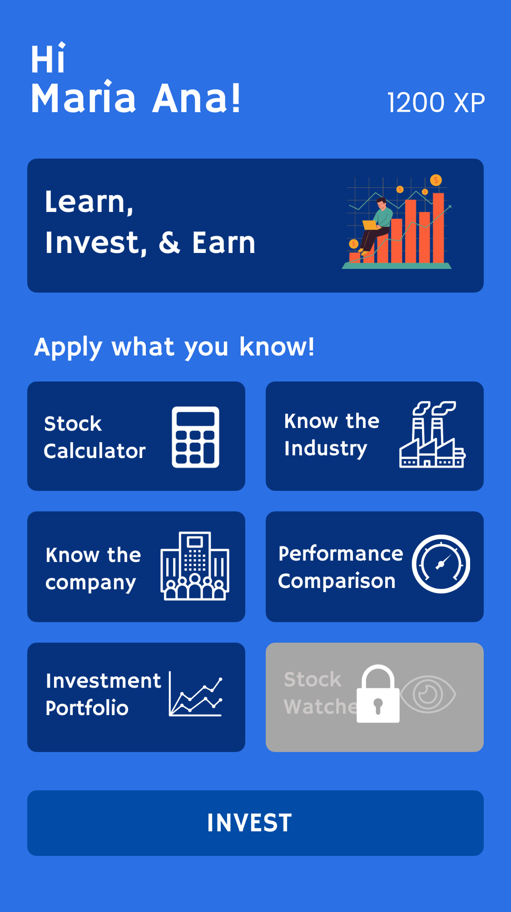
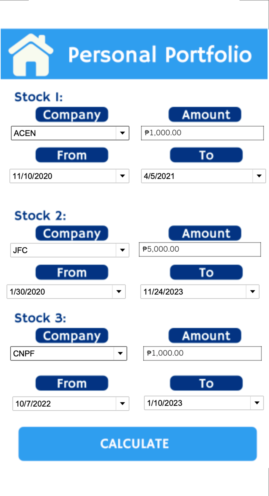

<h1>About</h1>
<b>Stocks ba? G na!</b> is a capstone project presented for <a href='https://www.linkedin.com/company/ftwfoundation/'>FTW Foundation</a> Data Science Scholarship Program that aims to use analytics to build an educational dashboard fit for mobile users, interested and beginning, to learn about the stock market.
  This project was created by Criselyn Agting, Ma. Alia Aguila, April Armintia, Milagros May Lozano and Mica Peña, sponsored by <a href='https://www.linkedin.com/company/wearegcash/'>GCash</a>.

<h1>The Process</h1>
<ol>
  <li>Problem</li>
  To attract customers to GStocks/crypto
   
  <b>Analytics Problem: </b>How can we make investing enticing to the mass market, using data storytelling techniques?
   
  <b>Desired Output: </b>"Laymanized view" of financial info for the not-so-finance-savvy person
  <li>Data Collection</li>
  Gathered data from The Philippine Stock Exchange, Wall Street Journal, Finbox, and Business Inquirer.
  <li>Data Cleaning</li>
  <li>EDA (Exploratory Data Analysis)</li>
  <i>The visual representation of ACEN's closing stock prices indicates a peak value of $12.92 over the span of five years.</i>
  
   
  <i>Determine the five-year stock price growth for various companies. ACEN Corporation stands out with the most significant increase, boasting a remarkable growth of 499.29%</i> 
  
   
  <i>Comparative analysis of Financial stocks (BDO, BPI, and MBT)
   
  While BDO exhibits the highest price movement among the three, it is noteworthy that the performance of companies within comparable industries appears to be consistent.</i>
   
  
  <li>Sentiment Analysis</li>
    <ol>
      <li>Utilized the DistilRoberta pre-trained sentiment analysis model from the Transformers library to analyze sentiment in financial news headlines and print the corresponding sentiment scores assigned to each headline</li>
      <li>Converted positive sentiments to 1, negative sentiments to -1, and  neutral sentiments to 0</li>
      <li>Calculated the average of the modified sentiment scores</li>
    </ol>
  <li>UI (User interface) Building</li>
  Created the App using Figma and used Tableau for the dashboard.
</ol>
<h1>Dataset</h1>
The data used for this project are stock market data downloaded from <a href='https://www.pse.com.ph/'>The Philippine Stock Exchange, Inc. — PSE</a>, <a href='https://www.wsj.com/'>WSJ</a>, and <a href='https://finbox.com/'>Finbox</a>. At the same time, the news headlines are scraped from <a href='https://business.inquirer.net/'>Business Inquirer</a>.
<h2>Features:</h2>
<ul>
  <li>Date - <i>November 26, 2018 to November 25, 2023</i></li>
  <li>Open</li>
  <li>High</li>
  <li>Low</li>
  <li>Close</li>
  <li>Volume</li>
  <li>Name - <i>AC, ACEN, AEV, AGI, ALI, BDO, BPI, CNVRG, DMC, EMI, GLO, GTCAP, ICT, JFC, JGS, LTG, MBT, MER, MONDE, NIKL, PGOLD, SCC, SM, SMC, SMPH, TEL, URC, WLCON</i></li>
  <li>Category - <i>Financial, Holding Firms, Industrial, Mining & Oil, Property, Services</i></li>
  <li>Business Address</li>
  <li>Email Address</li>
  <li>Website</li>
  <li>Telephone No.</li>
  <li>Description</li>
  <li>Company Name</li>
  <li>3Year_Return - <I>((Current Stock Price - Stock Price Three Years Ago) / Stock Price Three Years Ago) * 100</i></li>
  <li>1Year_Return - <I>((Current Stock Price - Stock Price One Year Ago) / Stock Price One Year Ago) * 100</i></li>
  <li>YTD_Return - <I>((Current Stock Price - Stock Price on January 1st) / Stock Price on January 1st) * 100</i></li>
  <li>5Year_Return - <I>((Current Stock Price - Stock Price Five Years Ago) / Stock Price Five Years Ago) * 100</i></li>
  <li>MA9 - <I>(Summation of Close Price for 9 periods) / 9</i></li>
  <li>MA50 - <I>(Summation of Close Price for 50 periods) / 50</i></li>
  <li>MA200 - <I>(Summation of Close Price for 200 periods) / 200</i></li>
  <li>CEO</li>
  <li>2022 Net Income</li>
  <li>Quarterly P/E Ratio</li>
  <li>Headlines</li>
  <li>Label_Sentiment - <i>-1, 0, 1, N/A</i></li>
  <li>Dividend Payout - <i>Quarterly, Semi-annually, Annually, N/A</i></li>
</ul>
<h1>Output</h1>
<h2>Product/Prototype</h2>

  
    
  
  
    
  
    
    
  
    
    
  

<h1>Recommendations</h1>
<ul>
  <li>Monitor and gather mobile user metrics to tailor-fit customer experience</li>
  <li>Profile existing GCash investors (GFunds, GStocks,GSave)</li>
  <li>Build a recommendation system to target GCash users similar to current GStock subscribers.</li>
</ul>

<h1>Contact US</h1>
<ul>
  <li><a href=''>Criselyn Agting</a></li>
  <li><a href=''>Ma. Alia Aguila</a></li>
  <li><a href='https://www.linkedin.com/in/aprilarmintia/'>April Armintia</a></li>
  <li><a href=''>Milagros May Lozano</a></li>
  <li><a href=''>Mica Peña</a></li>
</ul>

<h1>Special Thanks</h1>
<ul>
  <li><a href='https://www.linkedin.com/company/ftwfoundation/'>FTW Foundation</a></li>
  <li><a href='https://www.linkedin.com/company/wearegcash/'>GCash</a></li>
</ul>
